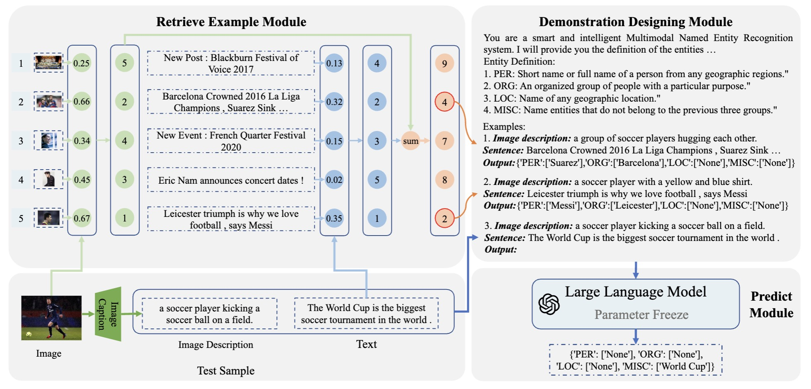
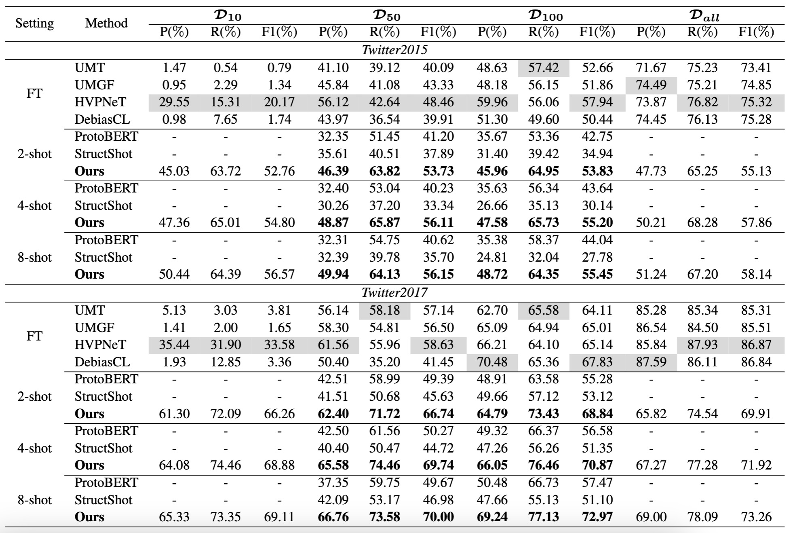

# In-context Learning for Few-shot Multimodal Named Entity Recognition

This repository contains the official `PyTorch` implementation of the paper: In-context Learning for Few-shot Multimodal Named Entity Recognition.

In the following, we will guide you how to use this repository step by step.


## Abstract
Thanks in part to the availability of copious annotated resources for some entity categories, existing studies have achieved superior performance in multimodal named entity recognition (MNER). However, in the real-world scenario, it is infeasible to enumerate all entity categories in advance. Therefore, in this paper, we formulate a new few-shot multimodal named entity recognition (FewMNER) task, which aims to effectively locate and identify named entities for a text-image pair only using a small number of labeled examples. Further, we explore the merit of in-context learning (ICL) and propose a novel framework to deal with FewMNER, where three points are taken into account: i.e., converting visual modality, selecting useful examples, and designing an effective task demonstration. Specifically, we first employ an image caption model to convert images into textual descriptions, enabling large language models to absorb information from visual modality. Then, we use the ranking of the sum of similarity rankings from both text and image modalities to select k-nearest examples, which form a demonstration context. Finally, we utilize the MNER definition and the meaning of each entity category as effective instruction. Extensive experimental results demonstrate that our framework outperforms baselines under several few-shot settings. 

## Architecture




## Result



## Preparation
Our code is based on PyTorch 1.12 Required python packages:

- numpy==1.21.6
- tqdm==4.64.0
- pytorch==1.12.1
- python==3.7.4
- transformers==4.29.0
- sentence_transformers==2.2.2

## How to run it


### Dataset

Download the orginal MNER dataset (Twitter-2015 and Twitter-2017) from [Google Drive](https://drive.google.com/file/d/15gdchpCWojP89d-_k3A7UPdGx7xnjZiY/view?usp=sharing), and unzip them into folder `./datatset/mner`


### Data Preprocessing

- Use `./process_data/change_dataset_format_twitter2015/2017.ipynb` to format orginal MNER dataset

- Use `./obtain_image_caption/image_caption_OFA_twitter2015/2017.py` to obtain the image caption

- Use `./split_data_similarity/split_dataset/split_twitter2015/2017.ipynb` to sample different data set ($\mathcal{D}_ {10}$, $\mathcal{D}_ {50}$, and $\mathcal{D}_ {100}$).

### Retrieve Example Module

Utilize `split_data_similarity/similarity_both_hardIndex_twitter2015/2017.py` to calculate the rank sum of image and text similarity


### In-context Learning for Few-shot MNER

Take $\mathcal{D}_{50}$ and 4-shot as an example

```
python twitter2015_50-1_shot-4.py
python twitter2017_50-1_shot-4.py
```

## Reference

If you find this project useful for your research, please consider citing the following paper:

```
@inproceedings{cai-etal-2023-context,
    title = "In-context Learning for Few-shot Multimodal Named Entity Recognition",
    author = "Cai, Chenran  and
      Wang, Qianlong  and
      Liang, Bin  and
      Qin, Bing  and
      Yang, Min  and
      Wong, Kam-Fai  and
      Xu, Ruifeng",
    editor = "Bouamor, Houda  and
      Pino, Juan  and
      Bali, Kalika",
    booktitle = "Findings of the Association for Computational Linguistics: EMNLP 2023",
    month = dec,
    year = "2023",
    address = "Singapore",
    publisher = "Association for Computational Linguistics",
    url = "https://aclanthology.org/2023.findings-emnlp.196",
    doi = "10.18653/v1/2023.findings-emnlp.196",
    pages = "2969--2979",
}
```

If you have any question, please issue the project or email [Chenran Cai](crcai1023@gmail.com), we will reply you soon.
